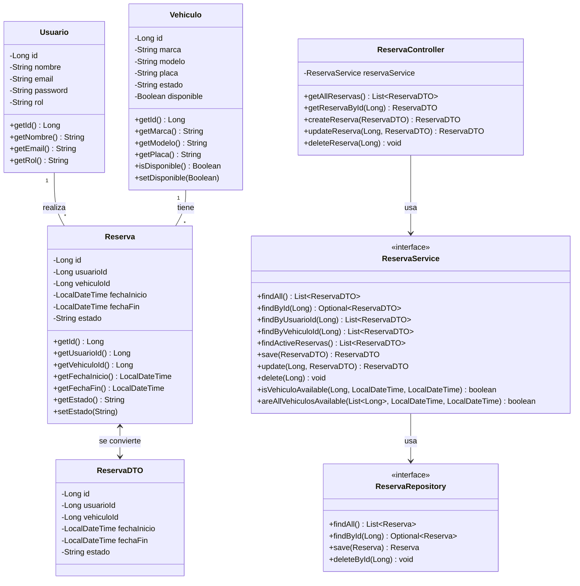
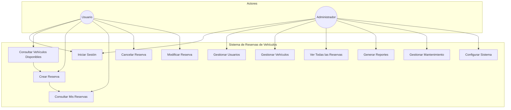

# Diagramas del Sistema de Reservas de Vehículos Institucionales

## Diagrama de Clases

Este diagrama de clases muestra las principales entidades del sistema y sus relaciones:

1. **Entidades Principales:**
   - `Usuario`: Representa a los usuarios del sistema
   - `Vehiculo`: Representa los vehículos disponibles para reserva
   - `Reserva`: Representa una reserva de vehículo

2. **DTOs y Servicios:**
   - `ReservaDTO`: Objeto de transferencia de datos para las reservas
   - `ReservaService`: Interface que define las operaciones de negocio
   - `ReservaRepository`: Interface para el acceso a datos

3. **Controladores:**
   - `ReservaController`: Gestiona las peticiones HTTP relacionadas con reservas

4. **Relaciones:**
   - Un Usuario puede tener múltiples Reservas
   - Un Vehículo puede tener múltiples Reservas
   - El Controller usa el Service
   - El Service usa el Repository
   - Las Reservas se convierten a/desde DTOs

Este diagrama proporciona una vista clara de la arquitectura en capas del sistema y cómo se relacionan los diferentes componentes entre sí.

## Diagrama de Casos de Uso

### Descripción de Casos de Uso

#### Usuario Regular
1. **Iniciar Sesión**
   - Autenticarse en el sistema
   - Mantener sesión activa
   - Cerrar sesión

2. **Consultar Vehículos Disponibles**
   - Ver lista de vehículos
   - Filtrar por fecha
   - Ver detalles de vehículos
   - Verificar disponibilidad

3. **Crear Reserva**
   - Seleccionar vehículo
   - Elegir fecha y hora de inicio/fin
   - Confirmar reserva
   - Recibir confirmación

4. **Consultar Mis Reservas**
   - Ver reservas activas
   - Ver historial de reservas
   - Ver detalles de cada reserva

5. **Cancelar Reserva**
   - Seleccionar reserva activa
   - Confirmar cancelación
   - Recibir confirmación

6. **Modificar Reserva**
   - Cambiar fecha/hora
   - Cambiar vehículo
   - Actualizar detalles

#### Administrador
1. **Gestionar Usuarios**
   - Crear usuarios
   - Modificar usuarios
   - Desactivar usuarios
   - Asignar roles

2. **Gestionar Vehículos**
   - Agregar vehículos
   - Modificar información
   - Dar de baja vehículos
   - Actualizar estado

3. **Ver Todas las Reservas**
   - Consultar reservas actuales
   - Ver historial completo
   - Filtrar por criterios
   - Exportar datos

4. **Generar Reportes**
   - Reportes de uso
   - Estadísticas
   - Reportes de mantenimiento
   - Exportar informes

5. **Gestionar Mantenimiento**
   - Programar mantenimiento
   - Registrar servicios
   - Actualizar estado
   - Ver histórico

6. **Configurar Sistema**
   - Ajustar parámetros
   - Gestionar permisos
   - Configurar notificaciones
   - Administrar catálogos
